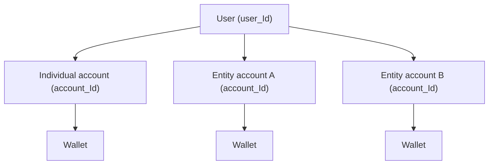

A user can be associated with multiple accounts. This happens when a user:

- Creates an individual account (receives their own `account_Id`)
- Is invited to join one or more entity (business) accounts

Each account has its own `account_Id`, wallet, and balances. The user interacts with each account independently.

<Info>
  A user is tied to a specific email address and a specific `integrator_id`. Their `user_Id` remains unchanged regardless of how many accounts they are associated with.
</Info>

## Retrieving a user's accounts

To see all accounts associated with a user, call the get user details endpoint. The response includes an `accounts` array listing every account the user belongs to, along with their role in each.

<Card icon="arrow-right" horizontal href="/api-reference/customer-management/get-details-of-a-single-user" title="Get user details">

</Card>

## How it works

Each account is fully independent: separate balances, separate transactions, and separate user roles.

## Roles across accounts

A user can have different roles in different accounts. For example, a user might be `root` on their individual account and `view` on an entity account they were invited to.

See [Multi-users account](/api-reference/multi-users-account) for details on inviting users and managing roles.
