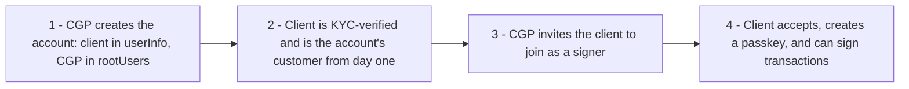
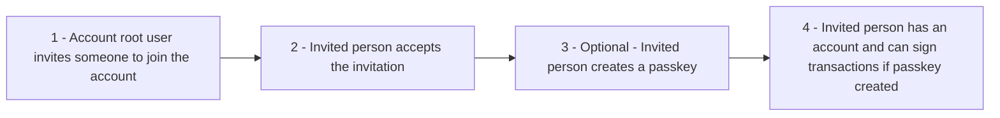
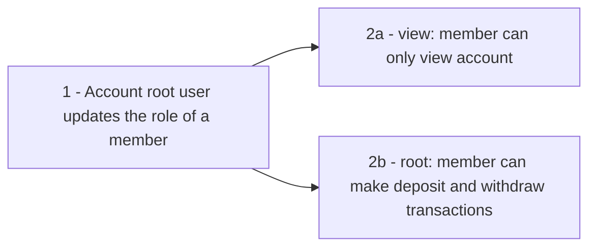

Multi-users account covers accounts with several signers, inviting users to an existing account, updating their roles, and allowing them to create their own passkeys.

## Which accounts can have multiple users

Both entity and individual accounts can have more than one signer (`root` user), each controlling the account with their own passkey:

- **Entity accounts** are multi-user by design: each root user and each beneficiary/representative is a separate person. Someone can be a signer without being a UBO, and a UBO without being a signer.
- **Individual accounts** can now also have several signers. Every signer is listed in the `rootUsers` field of the [create-individual-account](/api-reference/kyc) call, mirroring how entity accounts are created.

<Info>
  On any account, `userInfo` / `entityInfo` describes **who is being verified** (the customer), while `rootUsers` describes **who can sign**. For a standard individual account these are the same person; the sections below cover the cases where they differ.
</Info>

## Creating an account on behalf of a client

A wealth manager / CGP can create and manage an individual account for a client. This relies on the split between the verified customer and the signer:

- **`userInfo`** - the client. They are the KYC subject and appear as the account's customer from the moment it is created.
- **`rootUsers`** - the signer(s), for example the wealth manager, who control the account with their own passkeys.

The client is the account's customer immediately, even before they sign anything. When they are ready to take part in signing, invite them with the standard [invitation flow](#accepting-an-invitation) below. Once they accept and create a passkey, they become a signer (or `root` user) alongside the CGP.

<Tip>
  To hand over full control, the client (once a `root` signer) can demote the CGP to a `view` user by [updating roles](#promoting-and-demoting-roles-of-a-member). This leaves the client in control while the CGP keeps only the access you agree on.
</Tip>

## High-level flows

### Invitation-to-account

### Updating roles

## Technical implementation

### Inviting users

1. **Get invite users payload** - Request the payload that a root user must sign with their passkey to invite new users to the account. Use this endpoint to get the payload:

<Card
  title="Get invite users payload"
  icon="plus"
  horizontal
  href="/api-reference/account-management/step-1-get-invite-users-payload-passkey"
></Card>

2. **Submit signed invite-users payload** - Then call the below endpoint with the signed payload to execute the invitations:

<Card
  title="Invite users to a account"
  icon="plus"
  horizontal
  href="/api-reference/account-management/step-2-send-invitations-passkey"
></Card>

### Accepting an invitation

1. **Initialize OTP for a user** - Initialize an OTP for the invited person to authenticate by calling this endpoint:

<Card
  title="Initialize OTP for a user"
  icon="plus"
  horizontal
  href="/api-reference/otp-authentication/step-1-initialize-otp-send-email"
></Card>

2. **Authenticate with OTP** - Invited user enters the OTP code to create a session and authenticate with OTP. Call this endpoint to submit the authenticated session to accept the invitation:

<Card
  title="Authenticate with OTP code and create a session"
  icon="plus"
  horizontal
  href="/api-reference/otp-authentication/step-2-authenticate-with-otp-code"
></Card>

3. **(Optional) Create a passkey for the new member** - Allow the new user to create a passkey by using the below endpoint. The user must have an active OTP session (from step 1 and 2).

<Card
  title="Create authenticators"
  icon="plus"
  horizontal
  href="/api-reference/otp-authentication/step-3-create-passkeys-otp-auth"
></Card>

<Note>
  This last option step is only required if the new user has the role of `root`
  (Admin). Once passkeys are created, the user can use them for deposits and
  withdrawals.
</Note>

Invitations can be listed per account or per email via the [get-invitations-by-account-id](/api-reference/account-management/list-invitations-by-account) and [get-invitations-by-email](/api-reference/account-management/list-invitations-by-email) endpoints.

### Promoting and demoting roles of a member

- **Get update users role payload** - Request the payload that the root user must sign to change users’ roles. Call this endpoint:

<Card
  title="Get update users role payload"
  icon="plus"
  horizontal
  href="/api-reference/account-management/step-1-get-update-role-payload-passkey"
></Card>

- **Submit the signed payload** - Then call the below endpoint with the signed payload to execute the role update:

<Card
  title="Update users' role"
  icon="plus"
  horizontal
  href="/api-reference/account-management/step-2-update-users-role-passkey"
></Card>

## Roles and permissions

Four different roles exist:

- `root`: The root user is the admin of the account and has full permissions.
- `view`: The view user can only view the account and cannot make any transactions.
- `beneficiary`: Beneficiary users are UBOs of an entity account at the moment of creation. By default, they cannot make any transactions.
- `self_custodial`: All accounts created with a self-custodial wallet have this role.

The roles and permissions are described in the table below:

| Role             | Can view | Can deposit & withdraw | Can manage users | Can add bank accounts |
| :--------------- | :------- | :--------------------- | :--------------- | :-------------------- |
| `root`           | ✅       | ✅                     | ✅               | ✅                    |
| `view`           | ✅       | ❌                     | ❌               | ❌                    |
| `beneficiary`    | ✅       | ❌                     | ❌               | ❌                    |
| `self_custodial` | ✅       | ✅                     | ❌               | ✅                    |
