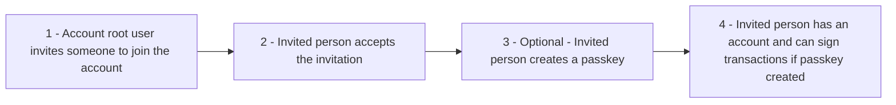
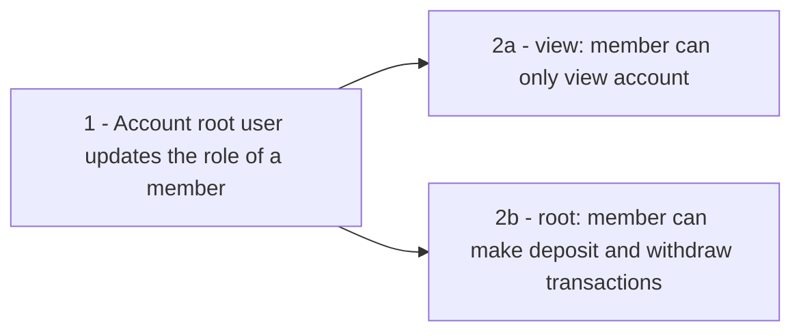

User management covers inviting users to an existing account, updating their roles, and allowing them to create their own passkeys.

## High-level flows

### Invitation-to-account

### Updating roles

## Technical implementation

### Inviting users

1. **Get invite users payload** — Request the payload that a root user must sign with their passkey to invite new users to the account. Use this endpoint to get the payload:

<Card
  title="Get invite users payload"
  icon="plus"
  horizontal
  href="/api-reference/user-management/get-invite-users-payload"
></Card>

2. **Submit signed invite-users payload** — Then call the below endpoint with the signed payload to execute the invitations:

<Card
  title="Invite users to a account"
  icon="plus"
  horizontal
  href="/api-reference/user-management/invite-users-to-a-byzantine-account-passkey-auth"
></Card>

### Accepting an invitation

1. **Initialize OTP for a user** — Initialize an OTP for the invited person to authenticate by calling this endpoint:

<Card
  title="Initialize OTP for a user"
  icon="plus"
  horizontal
  href="/api-reference/user-management/initialize-otp-for-a-user-email"
></Card>

2. **Authenticate with OTP** — Invited user enters the OTP code to create a session and authenticate with OTP. Call this endpoint to submit the authenticated session to accept the invitation:

<Card
  title="Authenticate with OTP code and create a session"
  icon="plus"
  horizontal
  href="/api-reference/user-management/authenticate-with-otp-code-and-create-a-session"
></Card>

3. **(Optional) Create a passkey for the new member** — Allow the new user to create a passkey by using the below endpoint. The user must have an active OTP session (from step 1 and 2).

<Card
  title="Create authenticators"
  icon="plus"
  horizontal
  href="/api-reference/user-management/create-authenticators-passkeys-for-a-user-otp-auth"
></Card>

<Note>
  This last option step is only required if the new user has the role of `root`
  (Admin). Once passkeys are created, the user can use them for deposits and
  withdrawals.
</Note>

Invitations can be listed per account or per email via the [get-invitations-by-account-id](/api-reference/account-data/get-all-invitations-for-an-account) and [get-invitations-by-email](/api-reference/account-data/get-all-invitations-for-an-email) endpoints.

### Promoting and demoting roles of a member

- **Get update users role payload** — Request the payload that the root user must sign to change users’ roles. Call this endpoint:

<Card
  title="Get update users role payload"
  icon="plus"
  horizontal
  href="/api-reference/user-management/get-update-users-role-payload"
></Card>

- **Submit the signed payload** — Then call the below endpoint with the signed payload to execute the role update:

<Card
  title="Update users' role"
  icon="plus"
  horizontal
  href="/api-reference/user-management/update-users-role-within-a-byzantine-account-passkey-auth"
></Card>

## Roles and permissions

Four different roles exist:

- `root`: The root user is the admin of the account and has full permissions.
- `view`: The view user can only view the account and cannot make any transactions.
- `beneficiary`: Beneficiary users are UBOs of an entity account at the moment of creation. By default, they cannot make any transactions.
- `self_custodial`: All accounts created with a self-custodial wallet have this role.

The roles and permissions are described in the table below:

| Role             | Can view | Can deposit & withdraw | Can manage users | Can add bank accounts |
| :--------------- | :------- | :--------------------- | :--------------- | :-------------------- |
| `root`           | ✅       | ✅                     | ✅               | ✅                    |
| `view`           | ✅       | ❌                     | ❌               | ❌                    |
| `beneficiary`    | ✅       | ❌                     | ❌               | ❌                    |
| `self_custodial` | ✅       | ✅                     | ❌               | ✅                    |
